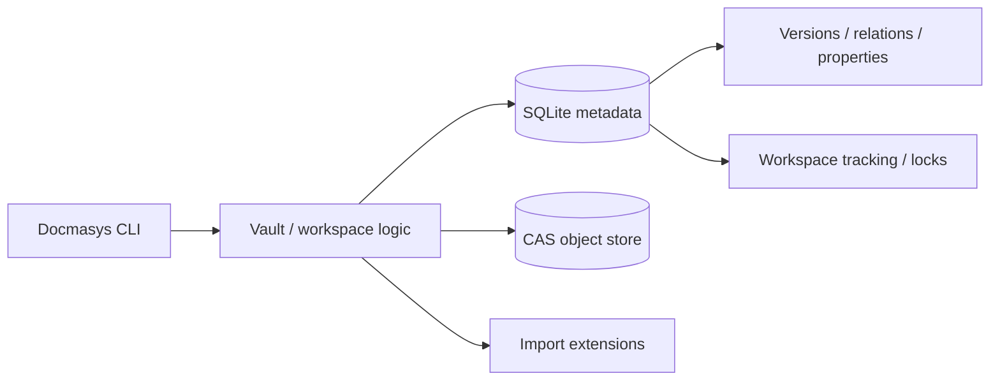
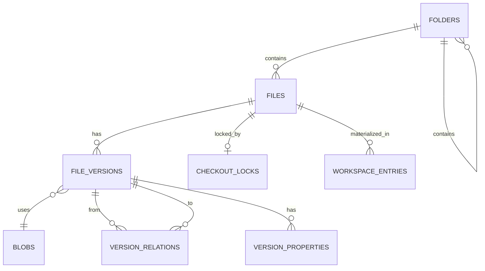
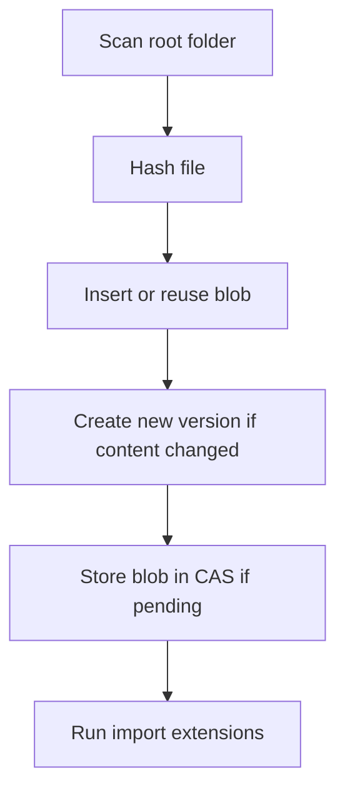
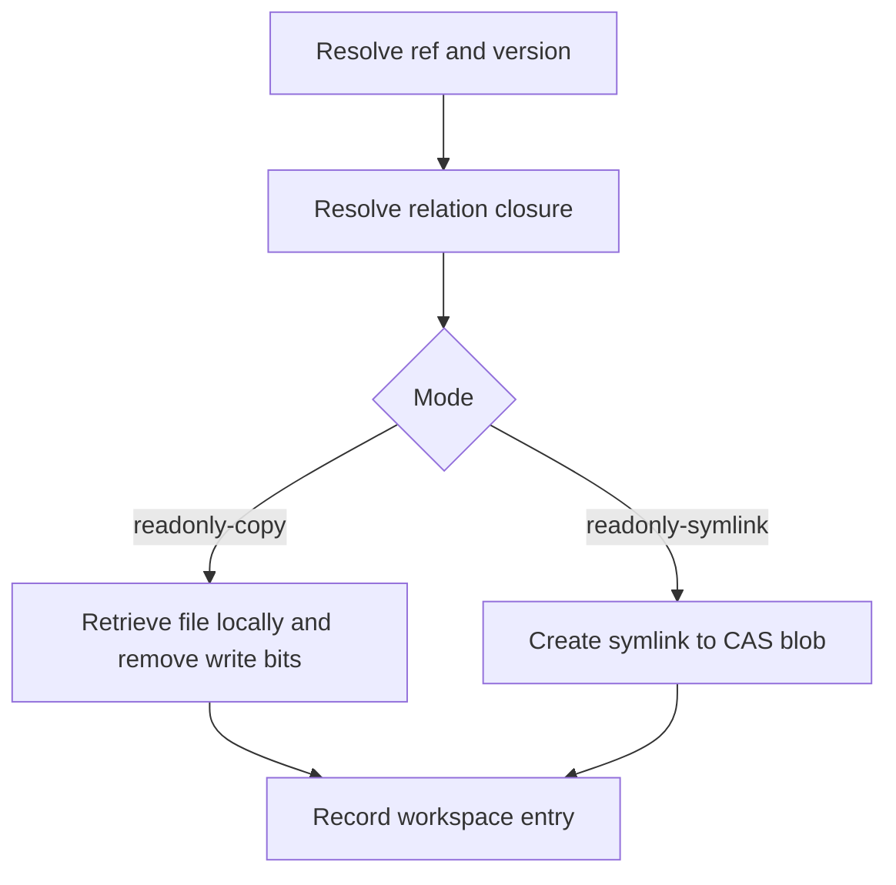
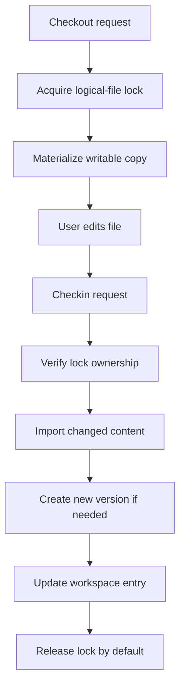
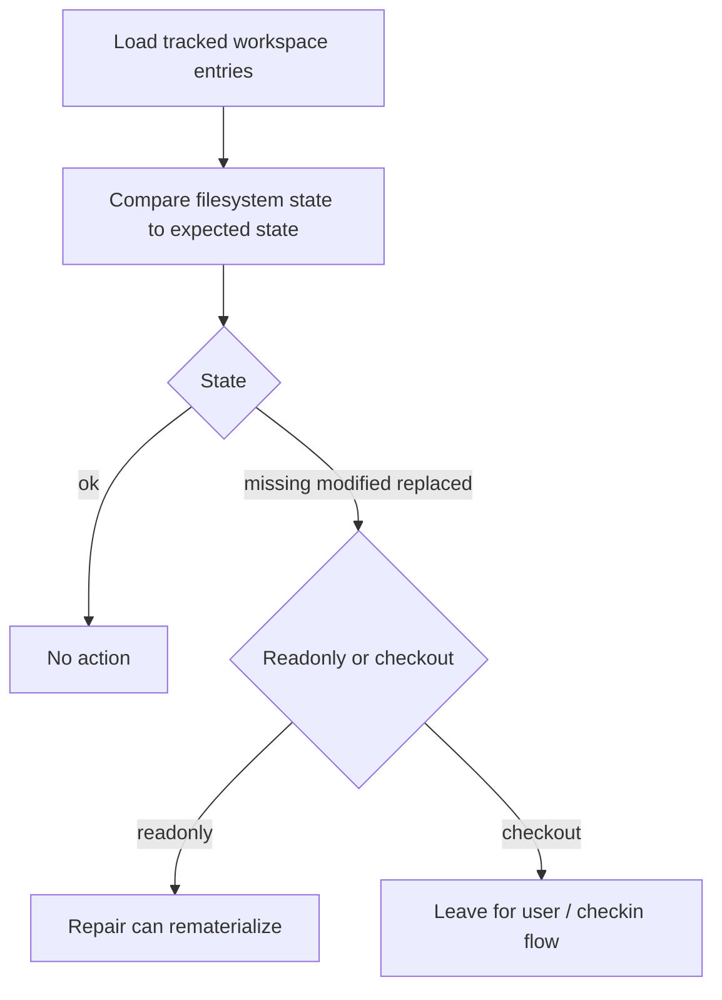

# Docmasys Core

[](https://github.com/sirsipe/Docmasys-Core/actions/workflows/ci.yml)

Docmasys Core is a small document/archive engine built around:

- content-addressed storage (CAS)
- SQLite metadata
- immutable file versions
- explicit file relations
- typed per-version properties
- workspace materialization
- checkout/checkin style editing flow

It is designed as a reusable core library plus a standalone CLI.

## Status

This is still a prototype, but the main archive/workspace loop now exists:

- import files into an archive
- materialize readonly views
- checkout writable copies
- check changes back in as new versions
- detect drift in managed workspaces
- repair readonly materializations
- manage stale locks explicitly

## Build

Requires:

- C++20 compiler
- OpenSSL
- Zstd
- SQLite3
- CMake

```bash
git clone https://github.com/sirsipe/Docmasys-Core
cd Docmasys-Core
cmake -S . -B build
cmake --build build
./build/bin/Docmasys help
```

## CLI overview

```text
Docmasys import    --archive <archive> --root <folder>
Docmasys get       --archive <archive> (--ref <path[@version]> | --refs-file <file>)... [--out <folder>] [--scope none|strong|strong+weak|all] [--mode readonly-copy|readonly-symlink]
Docmasys checkout  --archive <archive> (--ref <path[@version]> | --refs-file <file>)... --out <folder> --user <user> --environment <environment> [--scope none|strong|strong+weak|all]
Docmasys checkin   --archive <archive> (--ref <path> | --refs-file <file>)... --root <folder> --user <user> --environment <environment> [--keep-lock true|false]
Docmasys unlock    --archive <archive> (--ref <path> | --refs-file <file>)...
Docmasys status    --archive <archive> --root <folder>
Docmasys repair    --archive <archive> --root <folder>
Docmasys versions  --archive <archive> (--path <path> | --paths-file <file>)...
Docmasys relate    --archive <archive> [--from <path[@version]> --to <path[@version]> --type strong|weak|optional]... [--edges-file <file>]
Docmasys relations --archive <archive> (--ref <path[@version]> | --refs-file <file>)... [--type strong|weak|optional|all]
Docmasys props list   --archive <archive> (--ref <path[@version]> | --refs-file <file>)...
Docmasys props get    --archive <archive> (--ref <path[@version]> | --refs-file <file>)... --name <property>
Docmasys props set    --archive <archive> (--ref <path[@version]> | --refs-file <file>)... --name <property> --type string|int|bool --value <value>
Docmasys props remove --archive <archive> (--ref <path[@version]> | --refs-file <file>)... --name <property>
Docmasys locks list   --archive <archive>
Docmasys inspect   --archive <archive> [--root <folder>]
```

## Core concepts

### Archive
An archive is a directory containing:

- `content.db` SQLite metadata
- compressed CAS objects under `Objects/`

### Logical file
A stable archive path like:

```text
reports/summary.txt
```

### Version
Each logical file can have many immutable versions:

```text
reports/summary.txt@1
reports/summary.txt@2
```

### Blob
Actual file content is stored once in CAS by hash.

### Materialization
Files can be projected into a workspace as:

- `readonly-copy`
- `readonly-symlink`
- `checkout-copy`

### Checkout lock
A logical file can be marked as checked out by a user/environment/workspace tuple.

## Architecture



## Archive data model



## Main workflows

### Import workflow



### Readonly materialization workflow



### Checkout / edit / checkin workflow



### Status / repair workflow



## Behavior summary

### `import`
- imports a folder tree into an archive
- creates new versions only when content changed
- stores new blobs in CAS
- rejects tampered readonly tracked files inside managed workspaces

### `get`
- materializes one or more refs into a workspace
- supports readonly copy and readonly symlink modes
- can include relation closure by scope

### `checkout`
- acquires logical-file lock
- materializes writable copies
- requires explicit `--user` and `--environment`

### `checkin`
- accepts logical paths only
- verifies lock ownership
- imports changed content as new version
- updates workspace tracking
- releases lock unless `--keep-lock true`

### `status`
Reports tracked workspace state:

- `ok`
- `missing`
- `modified`
- `replaced`

### `repair`
- repairs readonly tracked files
- skips checked-out files

### `unlock`
- force clears stale locks
- intentionally blunt

## Batch usage

Batch input is consistent across commands:

- repeat selector flags multiple times
- or use manifest files like `--refs-file`, `--paths-file`
- manifest files ignore blank lines and `#` comments

Example `refs.txt`:

```text
reports/q1.txt@2
notes/todo.txt@1
```

Example `paths.txt`:

```text
reports/q1.txt
notes/todo.txt
```

Example `edges.txt`:

```text
reports/q1.txt@2 notes/todo.txt@1 strong
reports/q1.txt@2 refs/appendix.txt@1 optional
```

## Examples

### Create an archive

```bash
mkdir -p demo-src/docs
printf 'hello\n' > demo-src/docs/readme.txt

Docmasys import --archive ./demo-archive --root ./demo-src
```

### Inspect current logical files

```bash
Docmasys inspect --archive ./demo-archive
```

### List versions

```bash
Docmasys versions --archive ./demo-archive --path docs/readme.txt
```

### Materialize readonly copies

```bash
Docmasys get \
  --archive ./demo-archive \
  --ref docs/readme.txt \
  --out ./workspace \
  --mode readonly-copy
```

### Materialize readonly symlinks

```bash
Docmasys get \
  --archive ./demo-archive \
  --ref docs/readme.txt \
  --out ./workspace \
  --mode readonly-symlink
```

### Add properties

```bash
Docmasys props set \
  --archive ./demo-archive \
  --ref docs/readme.txt@1 \
  --name reviewed \
  --type bool \
  --value true

Docmasys props list --archive ./demo-archive --ref docs/readme.txt@1
```

### Add relations

```bash
Docmasys relate \
  --archive ./demo-archive \
  --from docs/readme.txt@1 \
  --to refs/appendix.txt@1 \
  --type strong

Docmasys relations --archive ./demo-archive --ref docs/readme.txt@1
```

### Checkout and checkin

```bash
Docmasys checkout \
  --archive ./demo-archive \
  --ref docs/readme.txt \
  --out ./workspace \
  --user alice \
  --environment laptop

printf 'changed\n' > ./workspace/docs/readme.txt

Docmasys checkin \
  --archive ./demo-archive \
  --root ./workspace \
  --ref docs/readme.txt \
  --user alice \
  --environment laptop
```

### Status and repair

```bash
Docmasys status --archive ./demo-archive --root ./workspace
Docmasys repair --archive ./demo-archive --root ./workspace
```

### Unlock a stale lock

```bash
Docmasys unlock --archive ./demo-archive --ref docs/readme.txt
```

## Extension system

Docmasys runs import extensions for newly created versions.

Extensions can:

- inspect imported file contents/path
- attach typed properties
- emit version-to-version relations

Built-in examples currently include:

- file facts
- relation manifest parsing for `.dmsrel`

Example `.dmsrel` file:

```text
strong docs/readme.txt@1
optional refs/appendix.txt@1
```

## Design notes

- paths are vault-relative; `ROOT/` is optional in user input
- omitting `@version` means latest
- property names are case-insensitive per version
- relation scopes:
  - `none`
  - `strong`
  - `strong+weak`
  - `all`
- `checkin` and `unlock` accept logical paths, not `@version` selectors
- security/identity enforcement is intentionally outside this core

## Test

```bash
cmake -S . -B build
cmake --build build
ctest --test-dir build --output-on-failure
```

## Continuous integration

GitHub Actions CI is configured in:

```text
.github/workflows/ci.yml
```

Current pipeline:

- runs on push and pull request
- builds on Ubuntu
- installs required native dependencies
- configures with CMake
- builds the project
- runs the full CTest suite

Development process expectations are documented in:

```text
docs/ARCHITECTURE_DEVOPS_POLICY.md
```

## Project docs

Additional lightweight project/process docs live under `docs/`:

- `docs/BACKLOG.md` - work tracking template and current priorities
- `docs/SECURITY.md` - security goals, threat model, and vulnerability reporting path
- `docs/DEPENDENCIES_AND_SBOM.md` - dependency expectations and SBOM guidance
- `docs/RELEASES_AND_COMPLIANCE.md` - release hygiene and CRA-adjacent notes

## Current limitations

- `inspect` is intentionally lightweight
- `relations` currently reports outgoing relations only
- batch commands fail fast on first invalid item
- readonly symlink behavior still needs validation on Windows environments
- `unlock` has no admin/permission layer
- ignore rules are not implemented yet
